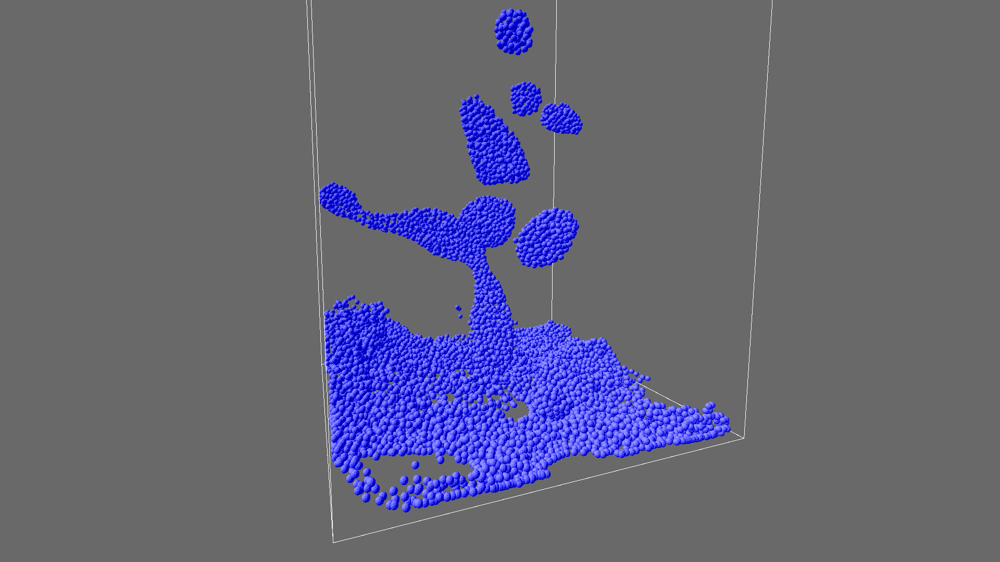

# SPH 3D Water Simulation

__Project creation date:__ 03.05.2019

## Description
This project simulates fluids in 3D with a particle-based viscoelastic simulation.\
The fluid simulation is executed on the GPU with OpenCL for better performance.
It was created for the [RGB_Led_Cube_Controller](https://github.com/MarvinOtt/RGB_Led_Cube_Controller) project.

## Technologies
* C#
* MonoGame
* OpenCL

## Remarks
The simulation is based on the following paper:\
http://www.ligum.umontreal.ca/Clavet-2005-PVFS/pvfs.pdf

## Pictures

